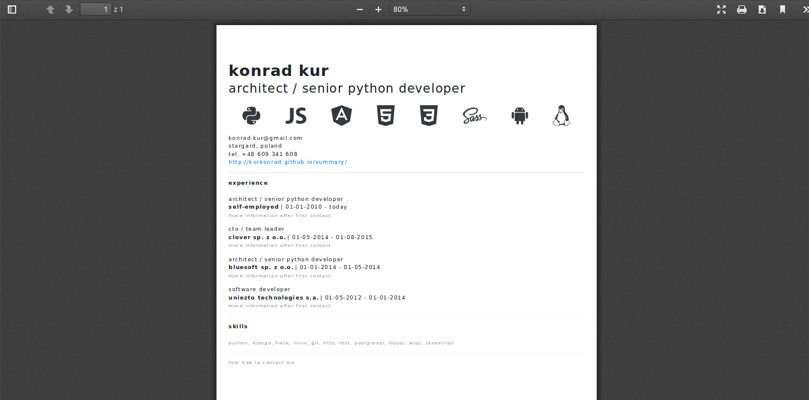

# free-cv-templates-boostrap-v4
build your own cv for free with wkhtml2pdf

# templates
cv_templates_01_software_developer.template


# install ubuntu 16.04
```
$ sudo apt update
$ sudo apt install wkhtmltopdf
```
https://wkhtmltopdf.org/downloads.html

# test
```
$ wkhtmltopdf http://www.google.com google.pdf
```

# build your own cv
```
$ cd free-cv-templates-boostrap-v4
$ wkhtml2pdf templates/cv_01_software_developer.html media/cv_01_software_developer.pdf
```
